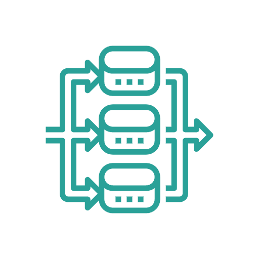
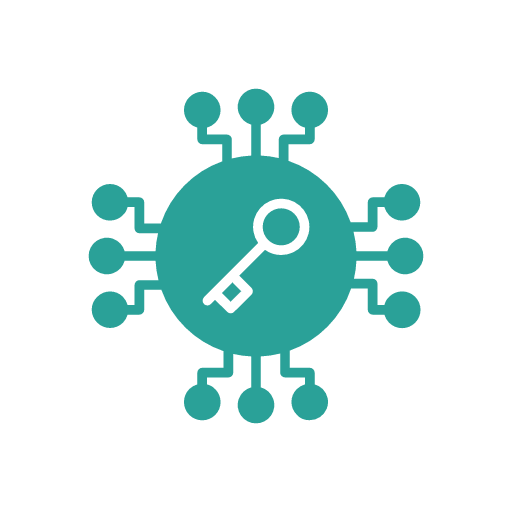

&nbsp;

<center>
  
  <h1 style="color: var(--title);">The Alan Programming Language</h1>
</center>

<div class="row">
  <div class="column">
    <center>
      
    </center>
    <h3 style="margin-top:0;">Implicitly parallel across events, arrays and IO</h3>
    Alan recognizes and exploits opportunities for parallelization without parallel programming (threads, channels, futures, locks, etc.)
  </div>
  <div class="column">
    <center>
      
    </center>
    <h3 style="margin-top:0;">No race conditions and fewer runtime errors</h3>
    Deadlocks, livelocks, undefined variables, divide-by-zero, integer under/overflow, array out-of-bounds access, etc, are not possible in Alan.
  </div>
  <div class="column">
    <center>
      
    </center>
    <h3 style="margin-top:0;">Granular third party permissions</h3>
    Alan's module resolution mechanism allows you to prevent third party dependencies from having access to standard libraries that they should not have access to.
  </div>
</div>

&nbsp;

## Try Alan

<table style="width: 100%;">
<tr>
<th></th>
<th></th>
</tr>
<tr>
<td>

```rust,editable,ignore,mdbook-runnable
import @std/app

on app.start {
  app.print("Hello, World!")
  emit app.exit 0
}
```

</td>
</table>

<a id="run-playground" onclick="analytics.track('RunPlayground');" class="cta-button">Run this code</a>

## Compare Alan

<center>
  <div class="carousel-container">
    <ul class="carousel my-carousel carousel--thumb">
      <input class="carousel__activator" type="radio" id="1" name="thumb" checked="checked"/>
      <input class="carousel__activator" type="radio" id="2" name="thumb"/>
      <input class="carousel__activator" type="radio" id="3" name="thumb"/>
      <div class="carousel__controls">
        <label class="carousel__control carousel__control--backward" for="3"></label>
        <label class="carousel__control carousel__control--forward" for="2"></label>
      </div>
      <div class="carousel__controls">
        <label class="carousel__control carousel__control--backward" for="1"></label>
        <label class="carousel__control carousel__control--forward" for="3"></label>
      </div>
      <div class="carousel__controls">
        <label class="carousel__control carousel__control--backward" for="2"></label>
        <label class="carousel__control carousel__control--forward" for="1"></label>
      </div>
      <li class="carousel__slide"><!-- Fake for weird CSS reasons --></li>
      <li class="carousel__slide">
        <pre class="code-border"><code class="language-golang">
  /* ALAN runs array operations in parallel
  utilizing all the available CPU cores
  if the array is large enough
  and the inner function given to it is pure. */
  fn sumMaybeConcurrent(nums: Array&lt;int&gt;): int {
    return nums.reducePar(fn (accum: int, val: int): int = accum + val)
  }
        </code></pre>
        <pre class="code-border"><code class="language-golang">
  /* GOLANG */
  func sumConcurrent(numbers []int) int {
    var v int64
    totalNumbers := len(numbers)
    goroutines := runtime.NumCPU()
    lastGoroutine := goroutines - 1
    stride := totalNumbers / goroutines
    var wg sync.WaitGroup
    wg.Add(goroutines)
    for g := 0; g < goroutines; g++ {
      go func(g int) {
        start := g * stride
        end := start + stride
        if g == lastGoroutine {
          end = totalNumbers
        }
        var lv int
        for _, n := range numbers[start:end] {
          lv += n
        }
        atomic.AddInt64(&v, int64(lv))
        wg.Done()
      }(g)
    }
    wg.Wait()
    return int(v)
  }
        </code></pre>
      </li>
      <li class="carousel__slide">
        <pre class="code-border"><code class="language-golang">
  /* ALAN */
  fn fetchAndSum(urls: Array&lt;string&gt;): int {
    return urls
      .map(fn (url: string): int {
        const website = http.get(url) || http.none
        return toString(website.body).length()
      })
      .reducePar(fn (accum: int, val: int): int = accum + val)
  }
        </code></pre>
        <pre class="code-border"><code class="language-java">
  /* JAVA */
  Integer fetchAndSum(String...urls) {
    var sum = CompletableFuture.completedFuture(0);
    try {
      return Stream
            .of(urls)
            .parallel()
            .map(url -> httpClient
                .sendAsync(request(url), BodyHandlers.ofString())
                .thenApply(HttpResponse::body)
                .thenApply(String::length))
            .reduce(sum, (prev, curr) -> prev
                .thenCombine(curr, (p, c) -> p + c))
            .get();
    } catch(Exception e){
      System.out.println(e.toString());
      return 0;
    }
  }
        </code></pre>
      </li>
      <li class="carousel__slide">
        <pre class="code-border"><code class="language-javascript">
  /* ALAN automatically executes IO concurrently when possible */
  fn getValidUids() {
    const authUids = Auth.getAllUsers().map(fn (u: AuthUser): int = u.id)
    const dbUids = Store.getAllUsers().map(fn (u: User): int = u.uid)
    const crmUids = Crm.getAllUsers().map(fn (u: CrmUser): int = u.uid)
    return authUids.filter(fn (v: int): bool = dbUids.has(v) && crmUids.has(v))
  }
        </code></pre>
        <pre class="code-border"><code class="language-javascript">
  /* NODE.JS equivalent */
  async function getValidUids() {
    const [authUsers, dbUsers, crmUsers] = await Promise.all([
      Auth.getAll(),
      Store.getAllUsers(),
      Crm.getAllUsers()
    ]);
    const authUids = authUsers.map(u => u['id']);
    const dbUids = dbUsers.map(u => u['uid']);
    const crmUids = crmUsers.map(u => u['uid']);
    return authUids.filter(v => dbUids.includes(v) && crmUids.includes(v))
  }
        </code></pre>
      </li>
      <div class="carousel__indicators">
        <label class="carousel__indicator" for="1"></label>
        <label class="carousel__indicator" for="2"></label>
        <label class="carousel__indicator" for="3"></label>
      </div>
    </ul>
  </div>
</center>

&nbsp;

<center>
  <a href="https://docs.alan-lang.org/getting_started.html" onclick="analytics.track('DownloadCTA');" class="cta-button">Get Started</a>
</center>

## Contact

Please reach out on [Discord](https://discord.gg/XatB9we) or email us at hello at alantechnologies dot com.