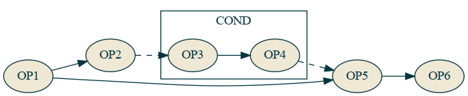
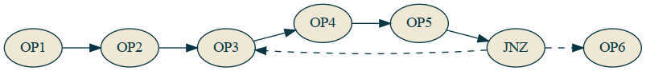
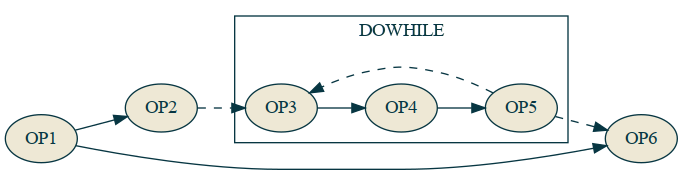

# The Turing-Completeness Problem

**4 November 2020 | Luis F. De Pombo, David Ellis**

What if we could write programs that could be automatically parallelized? Part of the work of Alan Turing and Alonzo Church on [computability](https://en.wikipedia.org/wiki/Computability) demonstrated that for some programs it cannot be determined ahead of time whether or not the program can be computed. This constitutes the crux of the [Halting Problem](https://en.wikipedia.org/wiki/Halting_problem). This "Turing-Completeness Problem" is not an issue with what they have shown, but how the software development process is hindered by the lack of assurances on computability and our industry's lack of recognition of the burden this has put onto software developers. Further, it has been exacerbated by the actual computing mechanisms, such as multithreading, NUMA, GPGPU, and distributed computing, which have moved away from the "single tape" Turing Machine model of computation that most programming languages are founded upon.

The following snippet of C code succinctly contains the problems of Turing completeness complicating modern development:

```c
while (node) {
  doSomethingWith(node);
  node = node->next;
}
```

1. *Automatic Parallelization* - It's not possible to automatically parallelize this code. The number of nodes is not clear to the compiler for it to potentially bunch those calls across threads, and it's also unclear if the function call mutates the node and adds/removes nodes to process.
2. *Halting Problem* - It's not possible to know if the code will halt, even ignoring the idea that `doSomethingWith` may always add a new `node` to the one it is processing, there's nothing stopping a node from pointing at itself and never halting that way.

Automatic parallelization is only a problem because we want/need to parallelize our code. Until very recently this was a niche need as [computing power had been increasing exponentially for decades and has only flattened in the past decade](https://www.karlrupp.net/2015/06/40-years-of-microprocessor-trend-data/). If this was still the case it is likely that it would have remained a niche problem that only experts need to worry about, but with multicore now the norm even in personal laptops and unlikely to go away as [signal propagation itself becomes the limiting factor](http://www.fisgeo.unipg.it/luca.gammaitoni/fisinfo/documenti-fisici/physical-limits-silicon.pdf), it has become a problem for the average developer, as well.

The issue with the Halting Problem itself is much more contentious. Turing demonstrated that it is not possible to determine whether arbitrary compute will halt or run forever so this lack of determinism has been tolerated as an unfortunate reality of all compute that must simply be dealt with. However, we posit that no *practially useful* computation will take forever because its result cannot affect the finite reality of our lives, so programmers have already been finding an imperfect subset of Turing completeness for their own problem domains in an ad-hoc intuitive sense to be able to actually produce valuable calculations for their users.

In a single-threaded world, this problem has been mostly a small annoyance -- on those occasions where you have written infinitely-looping code, find the section of code that the processor is executing over and over again, study how it entered this state, and figure out how to prevent that state from occurring again -- or abort on detection of said state. But in a multi-threaded, multi-machined cluster computing world, on those occasions where you have written an infinite loop, even detecting an infinite loop that spans multiple machines is a challenge, let alone gathering the data you need to debug the cause of this invalid state. This is further exacerbated by the non-determinism inherent to multiple interacting Turing machines not executing in lockstep with each other making reproduction of the problem even more difficult.

Side-stepping the Halting Problem by defining a barely-Turing-incomplete subset, also makes the automatic parallelization story possible. Now the compiler can work with code that it can determine where and how it could parallelize the work and has the ability to model its finite execution time to determine whether or not parallelization is worth it under various conditions.

This is the thesis of Alan, that with minor constraints on the language that we believe the vast majority of developers will not notice, or at least won't mind, we can be sure that the code you write always halts, and we can parallelize your code for you. We can make models for runtime estimates at compile time that only require the size and "shape" of the data to get an answer and can therefore determine not only how to parallelize your code, but whether or not it makes sense given the data being operated on. We have not yet accomplished all of these claims, but this is now only a matter of time and effort. :)

The root of most of the problems with the example C code involves the ambiguity in the data structure and the behavior of the user-defined function. The other problem is that the while loop is an unbounded looping construct that cannot be reasoned about except "the body of the while loop is executed zero or more times." In Alan, *arbitrary* looping and recursion are disallowed, and all data is built on top of data types with knowable constraints, no arbitrary JUMP statements or data pointer logic allowed.

What this means in practice is that instead of writing that while loop above for your list of nodes, you would write something like:

```ln
nodes.each(doSomethingWith)
```

Your intent to perform a side-effect action on each of the nodes in the list is clear, and the Alan compiler can determine the "purity" of the function -- whether or not it mutates the input argument or an outer scope -- to determine if it *could* execute the operations in parallel. Then at runtime it can use the estimated execution time of the function, the number of nodes in the `nodes` array, and the cost to distribute that work across multiple threads, to decide *if* it will execute the operations in parallel.

This can even apply across simple sequentially-written lines of code:

```ln
fn example(file1: string, file2: string): Array<Array<int64>> {
  const matrix1 = loadFile(file1).parseMatrix()
  const matrix2 = loadFile(file2).parseMatrix()
  return matrix1 * matrix2
}
```

Not only is the matrix multiplication a trivially parallelizable operation that likely will be parallelized for any large-ish matrix, but reading the files from disk and then parsing their contents may be done in parallel before the matrix multiplication because the performance benefit is there to do so.

To accomplish automatic parallelization, we need something different from a classic Turing tape to compile to. We call this the Alan Graphcode: a bytecode format with graph annotations that is guaranteed to have no cycles. A dependency graph of operations to perform, with some of these also having a subgraph of operations to perform, provides us with the information we need to know which operations are safe to execute in parallel, coupled with (implied) operation execution time estimates to determine if it makes sense to do so.

Alan's acyclic graphcode seems incompatible with any sort of control flow at first glance, though, since a dependency graph of operations that must all be executed appears to preclude the behavior of JUMP operations, like the classic [JNZ (Jump if Not Zero)](https://www.aldeid.com/wiki/X86-assembly/Instructions/jnz). Alan allows `if` statements and even [guaranteed halting versions of classic looping constructs are in a standard library](https://docs.alan-lang.org/std_seq.html) that provide a predictable "worst case" execution time based on a maximum iteration count allowed. We will demonstrate how Alan allows control flow with a graph-based representation that makes automatic parallelization possible.


Here two operations `OP1` and `OP2` run, then a `JNZ` runs. If the check is not zero, it skips to only run `OP5` and `OP6`, otherwise it runs `OP3` and `OP4` before running `OP5` and `OP6`.

This is a basic if statement for something like:

```
var a = op1();
var b = op2(a);
if (b) {
  var c = op3();
  a = op4(c);
}
var d = op5(a);
return op6(d);
```

The equivalent representation in a graph would be something like:



Here, the conditional call is a special COND node that may or may not execute the specified graph named `if`. All of the nodes of the main graph are executed, but the COND operation may or may not execute the inner subgraph. There is absolutely no parallelization possible based on the set of dependencies, but it's clear that `OP5` can't run until both `OP1` and `COND(if)` are run.

Back to classic Turing machines, what is the opposite of an `if` statement in a Turing tape? It's not `else if` or `else` as those are just other forward jumps on different conditions. The opposite of an `if` is a `do-while` statement, because that is a jump *backwards*. 



```
var a = op1();
var b = op2(a);
do {
  var c = op3();
  a = op4(c);
  var d = op5(a);
} while (d);
op6(a);
```

The equivalent in a graph representation would be:



Here a DOWHILE opcode runs the loop sub-graph over and over until the expected condition is met. So with these two special opcodes COND and DOWHILE we can reproduce the behavior of JNZ's forwards and backwards jumping and we can enter infinite loops with DOWHILE, meaning we should be Turing Complete.

So how do we make this barely *not* Turing complete? We make a list/array type a first class citizen in the VM itself and then we only add operations that know the bounds that they are to operate on based on that list or some other condition that cannot be *directly* mutated by the user's own code.

Now for an array of data we can have an `each` opcode that applies a given sub-graph of operations to every node in the array. It can tell based on the expected execution time of the graph and the number of nodes and the cost to send that data to multiple threads whether or not to do a fork-join or not. Probably no for 10 elements and probably yes for 10 billion, but where's the threshold and why? That's something better left for a computer to decide in realtime based on the data rather than a developer.

This is the fundamental structure behind Alan and it's AVM. There are more goodies around automatic transforms of the graph to better optimize IO that we have partially working right now and automatic rewriting of the graph for stream processing that we're still figuring out, but with just this we can get better parallelization strategies automatically while keeping your own code short and clean.
