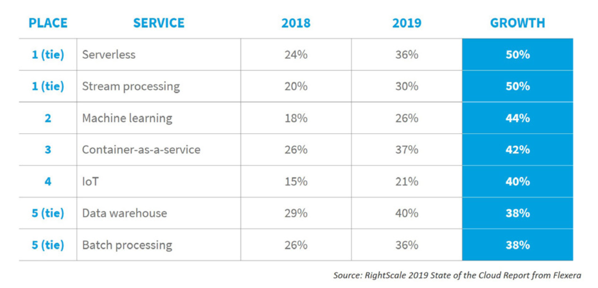

# Why we created Alan?

We are a team of developers that got tired of managing and re-writing software products as they scaled -- just like everyone else.
75% of enterprises are running, or planning to run, their software operations on Serverless according to [Pathfinder Report 2019 The Journey to Serverless-First 2019 from 451 Research](https://d1.awsstatic.com/serverless/The%20Journey%20to%20Serverless-First%20-%20451%20Research.pdf). Serverless offers an interface for developers to scale their software in the cloud using a pay-as-you-go model and without any DevOps or system administration operations. Serverless computing has only been around since 2014 and it already is the fastest growing cloud offering category, above machine learning, at 50% YoY according to [RightScale 2019 State of the Cloud Report from Flexera](https://resources.flexera.com/web/media/documents/rightscale-2019-state-of-the-cloud-report-from-flexera.pdf).

However, Serverless comes with the some drawbacks:
- Code has to be organized into “functions” in order to work
- “Cold starts”, or a delay between the invocation and execution of functions
- No state can be shared across function executions
- The runtime of a function is typically capped at 10-15 minutes

We believe Serverless is just the tip of the iceberg in terms of enabling automatic scale. We built the `alan` compiler and runtime so it could parallelize your code without concurrent or asynchronous programming (threads, promises, futures, channels, etc). `alan` is a natively-parallel, statically-compiled, type-inferred language with a familiar syntax and many compile-time and run-time safety guarantees. Alan's purpose is to provide a programming language that can be easy to pick up while having solid performance that can scale with you and your project while completely decoupling what your software does from how it scales.

There is still a ways to go for Alan to become a category defining tool, but if you are moved by the vision please try it out, give us your feedback and help us shape it. Alan is not Turing-Complete in order to allow iteration and recursion that is guaranteed to halt. However during these uncertain times, we are inspired by the creativity and resilience Alan Turing had in the face of oppression.